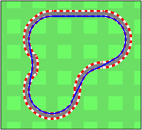
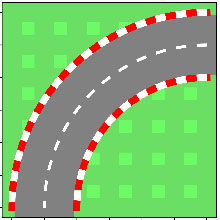
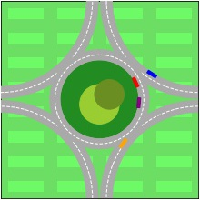

# Learning to drive using convex-convave programming





## Notebooks
- [simple_road.ipynb](simple_road.ipynb): Simple road segment
- [complex_road.ipynb](complex_road.ipynb): Complex Formula 1 circuit
- [roundabout.ipynb](roundabout.ipynb): Multi-agent roundabout crossing

## Requirements
The code requires [DCCP](https://github.com/cvxgrp/dccp) and [CVXPY](https://github.com/cvxgrp/cvxpy). To install these requirements, simply type:
```sh
pip install -r requirements.txt
```

## Licence
Copyright (c) 2019 Alexandre Carlier, released under the MIT licence.
